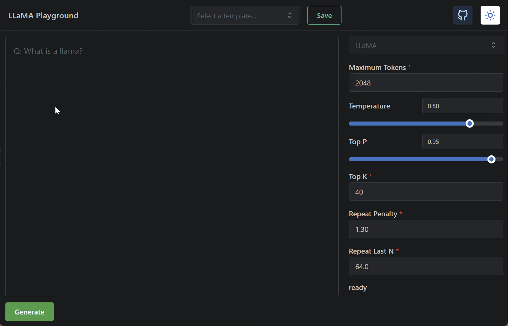

# 🦙 LLaMA Playground 🛝

A simple Open-AI inspired interface that uses [llama.cpp#tcp_server](https://github.com/ggerganov/llama.cpp/tree/tcp_server) in the background.



## Difference vs. other interfaces

Other interfaces use the llama.cpp cli command to run the model. This is not ideal since it requires to spawn a new process for each request. This is not only slow but also requires to load the model each time. This interface uses the llama.cpp tcp_server to run the model in the background. This allows to run multiple requests in parallel and also to cache the model in memory.

## Features

- Simple to use UI
- Able to handle multiple requests in parallel quickly
- Controls to change the model parameters on the fly
  - Does not require rebooting, changes are applied instantly
- Save and load templates to save your work
  - Templates are saved in the browser's local storage and are not sent to the server

## About

Built on top of a modified [T3-stack](https://github.com/t3-oss/create-t3-app) application.  
Fastify is used instead the regular next.js server since websocket support is needed.  
[Mantine](https://mantine.dev/) is used for the UI.  
[tRPC](https://trpc.io/) is used for an end-to-end type-safe API.

The fastify server starts a tcp_server from llama.cpp in the background.  
Upon each request, the server establishes a new TCP connection to the tcp_server and sends the request.  
Output is then forwarded to the client via websockets.

## Notice

This is not meant to be used in production. There is no rate-limiting, no authentication, etc. It is just a simple interface to play with the models.

## Usage

### Getting the model

This repository will not include the model weights as these are the property of Meta. Do not share the weights in this repository.

Currently, the application will not convert and quantize the model for you. You will need to do this yourself. This means you will need the llama.cpp build dependencies.

- For ubuntu: `build-essentail make python3`
- For arch: `base-devel make python3`

```bash
# build this repo
git clone https://github.com/ggerganov/llama.cpp
cd llama.cpp
make

# obtain the original LLaMA model weights and place them in ./models
ls ./models
65B 30B 13B 7B tokenizer_checklist.chk tokenizer.model

# install Python dependencies
python3 -m pip install torch numpy sentencepiece

# convert the 7B model to ggml FP16 format
python3 convert-pth-to-ggml.py models/7B/ 1

# quantize the model to 4-bits
python3 quantize.py 7B
```

<sub><sup>^ (source [llama.cpp/README.md](https://github.com/ggerganov/llama.cpp/))</sup></sub>

Then you can start the server using one of the below methods:

### With Docker

```bash
# Clone the repository
git clone --depth 1 https://github.com/ItzDerock/llama-playground .

# Edit the docker-compose.yml file to point to the correct model
vim docker-compose.yml

# Start the server
docker-compose up -d
```

### Without Docker

```bash
# Clone the repository
git clone --depth 1 https://github.com/ItzDerock/llama-playground .

# Install dependencies
pnpm install # you will need pnpm

# Edit the .env file to point to the correct model
vim .env

# Build the server
pnpm build

# Start the server
pnpm start
```

## Development

Run `pnpm run dev` to start the development server.

## License

[MIT](./LICENSE)
